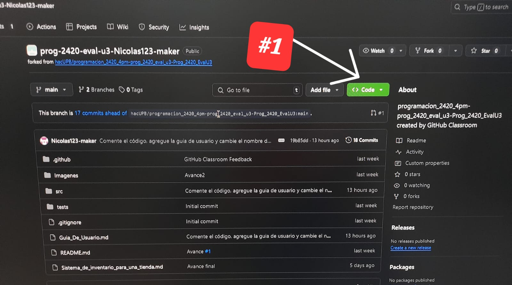
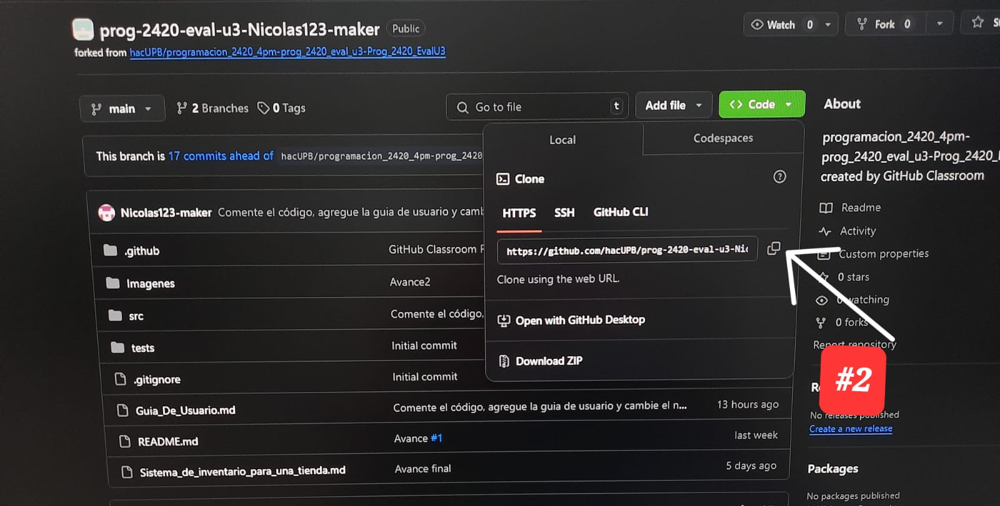

# ¡Bienvenido a la primera tienda virtual de medellín! -- Guía de usuario

### --> Pirmeros pasos:

###### Para clonar el repositorio siga los siguientes pasos:
1. Luego de acceder al repositorio en git hub, dele click al botón verde que se muestra a continuación:

2. Luego copie el código del repositorio, dando click en el botón que se muestra a continuación:

### --> Para el Administrador:

- La contra
