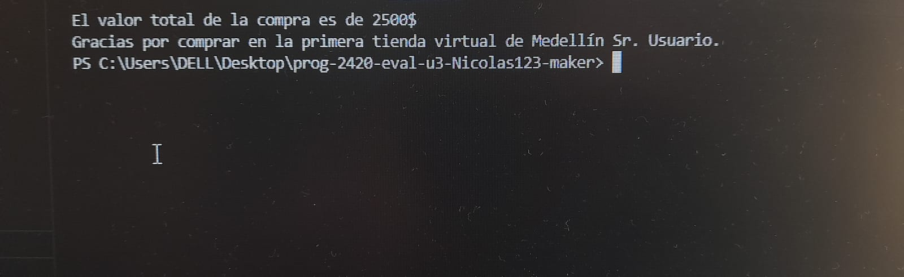

# ¡Bienvenido a la primera tienda virtual de medellín! -- Guía de usuario

### --> Pirmeros pasos:

- Para clonar el repositorio siga los siguientes pasos:
1. Luego de acceder al repositorio en git hub, dele click al botón verde que se muestra a continuación:

2. Luego copie el enlace del repositorio, dando click en el botón que se muestra a continuación:

3. Una vez copiado el enlace, abra la aplicación de escritorio git bash y copie lo siguiente:

4. Para utilizar el código te recomiendo usar visual studio code o puedes usar tu editor de confianza.

5. ¡Disfruta el código!

## Roles en el código.

### --> Para el Administrador:

¡Hola señor@ administrador! a continuación encontrará las instrucciones y algunos datos importantes para utilizar correctamente el código </!>

- Al iniciciar el programa y seleccionar el rol de administrador, este le pedira una contraseña, el programa de forma predeterminada tiene la siguiente contraseña:

    "Contraseña_predeterminada123"
    
    Aseguúese de copiarla tal cual aparece (incluyendo mayúsculas y el guión bajo) ya que si no lo hace correctamente, por seguridad el código se bloqueara durante 20 segundos, despues de los cuales podrá volver a intentarlo.

- Una vez ingresada la oontraseña el programa te permitira hacer 2 cosas, cambiar la contraseña o modificar los inventarios. Si elijes la segunda opción el programa te mostrara el inventario, este está dividido en 3 secciones, Mecatos, Aseo y Variedades. Una vez selecionada la seccion a modificar, el programa nos preguntará si queremos cambiar el precio de un producto o si queremos modificar la cantidad de ese producto, luego nos mostrara los productos que están en la sección que escogimos y nos preguntará por el producto que deseamos modificar.

  ¡OJO!
  Debes copiar el nombre del producto tal cual aparece en la pantalla del código, de lo contrario este no podrá funcionar correctamente.

  

- Luego te mostrará como quedó la sección que modificaste, por ejemplo:

  

### --> Para el Cliente:

Apreciado cliente, es un gusto tenerlo con nosotros. A continuación encontrará las instrucciones y datos importantes para utilizar correctaamente el código.

- Luego de preguntar por su nombre, el código le preguntara si desea ver los inventarios, de ser asi debera eperar 6 segundos mientras el código procesa la información. 

- Luego le mostrara el inventario y le preguntara la sección en la que se encuentra el producto que desea comprar y le mostrara los productos disponibles en la sección escogida.

  ¡OJO!
  Debes copiar el nombre del producto tal cual aparece en la pantalla del código, de lo contrario este no podrá funcionar correctamente.
  
    

- Podrás comprar las veces que quieras dentro de una sesión, cuando no quieras seguir comprando dile que no cuando el código te pregunte si deseas seguir comprando, al hacer esto el código te dirá el precio total de compra.

