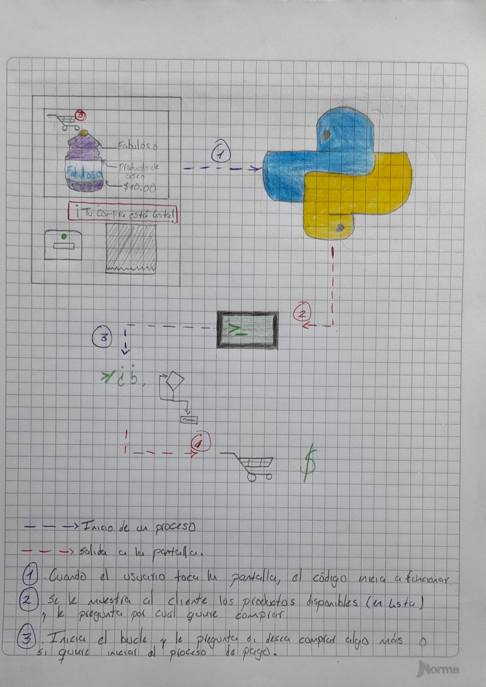
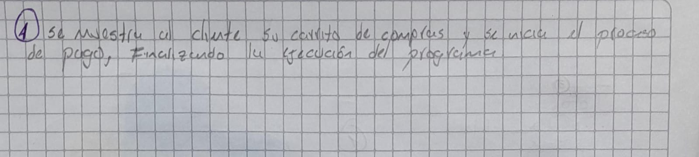

# Detelles del problema a resolver:
El sistema mostrará la lista de productos disponibles en la tienda, cuando el cliente seleccione un producto el programa le mostrará el producto que eligio y su valor, posterior a esto, le preguntara si desea seguir comprando; si es asi, guardará el costo del porducto anterior para irlo sumando con los posibles nuevos costos de los futuros productos que el cliente puede seleccionar, para mas adelante dar un total de la compra.

### --> Justificación:
Este programa es como si fuera una maquina expendedora pero con mayor variedad y con una mayor cantidad de productos.
Imagina por un momento una tienda que su fachada sea una pantalla, como las que se utilizan en Mcdonalds para hacer tu pedido a traves de esta. El programa lo que haria es mostarte una lista de los productos disponibles y te permitiría armar tu carrito de compras mostrandote al final de la selección de los productos que necesites el precio total de los productos seleccionados.

Viendo mas allá del código, después de armar tu carrito de compras y pagar, recibirías tus productos empacados cuidadosamente en bolsa (reutilizable claro ;) ) por medio de una cinta tranportadora. Tal vez la tienda como tal no sea muy utilizada porque se sale de lo común y tal vez la mayoría de personas prefieran mas una ienda tradicional (una en la que puedas ver los productos en persona) pero seria interesante tener una asi, de seguro mas de una persona iría por lo menos para tener la experiencia, y este código es la base para que una tienda así pueda existir.

 

### --> Estructuras de datos a utilizar:

Por el momento pienso utilizar las siguientes estructuras:

- Listas.
- Diccionarios.

### --> Diagrama del problema:

